# Arquitectura y servicios

Mapa de todo lo que corre en el proyecto: de dónde salen los datos, qué proceso los toca, dónde se guardan y
qué los programa. Detalle técnico de cada pieza en `project.md`; operación del servidor en `deploy/README.md`;
comandos en `make help`.

## 1. Flujo de datos

```mermaid
flowchart LR
    subgraph fuentes["Fuentes externas (APIs públicas con clave embebida)"]
        CPL["Cinépolis GraphQL<br/>api-g.cinepolis.com<br/>locations · billboards v2 · ticket (Seats, Tickets)"]
        CMX["Cinemex REST<br/>api.cinemex.com/rest/v2.37.2<br/>cinemas · movies por área · sessions/{id} · buy/selectTickets"]
        CPF["Cinépolis dulcería<br/>fab-struct-concession/graphql (MenuByType)"]
        DEL["Rappi · DiDi Food<br/>HTML del lado del servidor"]
    end

    WARP["Solo servidor: Cloudflare WARP (SOCKS5) + Privoxy (HTTP :8118)<br/>AC_EGRESS_PROXY · solo hosts de AC_EGRESS_PROXY_HOSTS<br/>el WAF de Cinépolis bloquea las IPs de AWS"]

    subgraph scraper["scraper/ (solo stdlib, /usr/bin/python3)"]
        RUN["scraper.run · make snapshot<br/>captura de cartelera 3/día<br/>cinepolis.py · cinemex.py → normalize → diff"]
        OCC["scraper.sample --occupancy<br/>plano a T−60 (preventa, solo a mano)"]
        POST["scraper.sample --post-start<br/>plano a +10…30 min (asistencia final)"]
        PRICE["scraper.sample --prices<br/>boletos por cine, formato y tipo de día"]
        CAP["scraper.sample --capacity<br/>aforo por sala"]
        CAL["scraper.sample --occupancy --chain cinemex --per-level<br/>calibración del semáforo (checkout, a mano)"]
        CONC["scraper.sample --concessions<br/>menú de dulcería por cine (Cinépolis)"]
        DLV["scraper.delivery<br/>dulcería a domicilio en Rappi y DiDi Food"]
        HEALTH["scraper.health<br/>salud de la captura"]
    end

    subgraph archivo["Archivo histórico (venv, psycopg)"]
        SYNC["sync.run · make sync<br/>:22 y :52 · marca de agua por tabla<br/>crudo → showtime + showtime_state"]
        PGDB[("PostgreSQL · esquema public<br/>local Docker hoy · RDS después<br/>identidad + versiones · eventos · muestreos")]
        PGAPP[("PostgreSQL · esquema app<br/>account · session · token · audit<br/>rol absolut_app")]
    end

    subgraph datos["data/ (fuera de git)"]
        DB[("snapshots.db (SQLite WAL)<br/>snapshot · current_showtime · event (incl. expired)<br/>auditorium · occupancy_sample · price_sample<br/>concession_price · delivery_price")]
        RAW["raw/{chain}/{fecha}/*.json.gz"]
        LOGS["logs/ run.log · sample.log · health.log"]
    end

    subgraph producto["Producto"]
        AN["analytics/ (funciones puras, sin dependencias)<br/>queries · findings · summary · history · seats · concessions · delivery · labels"]
        ARCH["archive/ (venv, psycopg, solo lectura)<br/>datasets del explorador: cines y salas · funciones · precios<br/>status: latencia, tamaños, marcas de agua"]
        AUTH["auth/ (venv, psycopg, boto3)<br/>cuentas · sesiones · enlaces · correo SES/console · auth.cli"]
        APP["app.py · Streamlit (.venv) · st.navigation según sesión y rol<br/>views/login · olvide · restablecer<br/>views/cartelera (3 capas) · dulceria · datos · usuarios · operaciones (admin)<br/>ui/common.py helpers · ui/session.py cookie"]
        CADDY["Caddy · HTTPS (basic auth opcional hasta tener dominio)"]
    end

    CPL -. en el servidor, vía .-> WARP
    CPF -. en el servidor, vía .-> WARP
    CPL --> RUN
    CMX --> RUN
    CPL --> OCC & POST & PRICE & CAP
    CMX --> PRICE & CAP & CAL
    CPF --> CONC
    DEL --> DLV
    RUN --> DB & RAW
    OCC & POST & PRICE & CAP & CAL & CONC & DLV --> DB
    DB -. lee .-> HEALTH
    HEALTH --> LOGS
    DB -. mode=ro .-> SYNC
    RAW -. crudo por captura .-> SYNC
    SYNC --> PGDB
    SYNC -. sync_status.json .-> HEALTH
    RUN & OCC & POST & PRICE & CAP --> LOGS
    DB -. solo lectura .-> AN --> APP --> CADDY
    PGDB -. solo lectura .-> ARCH --> APP
    APP --> AUTH --> PGAPP
    AUTH -. invitación / restablecer .-> SES["Amazon SES<br/>AC_MAIL_BACKEND=ses"]

    subgraph futuro["Siguiente fase (fuera del servidor)"]
        GEO["geo/ · pipeline batch en la Mac<br/>INEGI Censo AGEB · CONAPO · DENUE · Metro · isócronas ORS"]
        GEODB[("geo.db<br/>cinema_geo · cinema_features · cinema_archetype")]
    end
    GEO --> GEODB -. solo lectura .-> AN
```

Reglas que sostiene el diagrama:

- **Un solo escritor** sobre `snapshots.db`: todo lo que escribe corre en serie desde el mismo timer o en minutos
  distintos (:07); si coincide, SQLite espera hasta 60 s.
- **El dashboard nunca escribe datos.** Abre SQLite en modo lectura, el archivo en Postgres en solo lectura (`archive/`)
  y toda la lógica de negocio vive en `analytics/` y `archive/`, para envolverla después en un API sin reescribir. Lo
  único que escribe es `auth/`, en su propio esquema `app` (cuentas, sesiones, enlaces, auditoría) con el rol
  `absolut_app`, que en `public` solo tiene SELECT.
- **El scraper no tiene dependencias**; el dashboard y el `sync` usan el venv. El futuro `geo/` tendrá su propio venv y
  no corre en el servidor.
- **Cinépolis se alcanza por Cloudflare WARP desde el servidor.** `api-g.cinepolis.com` (cartelera, planos, boletos y
  dulcería) está detrás de Cloudflare y su WAF bloquea los rangos de AWS por ASN (verificado 2026-09-10). En el servidor
  el cliente WARP corre en modo proxy (SOCKS5 local, registro gratuito, sin cuenta) y Privoxy lo convierte en proxy HTTP;
  `scraper/http.py` manda por ahí solo los hosts de `AC_EGRESS_PROXY_HOSTS`. Cinemex, Rappi y DiDi salen directo. En la Mac
  no hace falta: `AC_EGRESS_PROXY` vacío. Operación en `deploy/README.md`.
- **Postgres es archivo; el dashboard lo lee solo en el explorador (etapa 1).** El `sync` lee SQLite en solo lectura y el
  crudo, y escribe en Postgres por marca de agua; nada más escribe en `public`. La historia de cada función se
  reconstruye desde el crudo, así que si cambia la normalización se trunca y se vuelve a cargar. La cartelera y la
  dulcería siguen leyendo SQLite hasta la etapa 2.
- **Sesión por cookie propia.** Streamlit no escribe cookies: `ui/session.py` la pone con JavaScript desde un iframe del
  mismo origen y recarga la página; `st.context.cookies` la lee en el handshake. En la base solo vive su sha256; cambiar
  la contraseña o desactivar la cuenta revoca todas las sesiones y surte efecto en ≤ 60 s.

## 2. Programación: qué dispara cada servicio

```mermaid
flowchart TB
    subgraph mac["Mac (launchd, hasta desplegar)"]
        L3["com.absolut-cinema.scraper<br/>07:30 · 13:30 · 20:30"]
        L15["com.absolut-cinema.seats<br/>cada hora (:50)"]
        LD["com.absolut-cinema.daily<br/>06:00"]
        LDL["com.absolut-cinema.delivery<br/>15:00"]
        LSY["com.absolut-cinema.sync<br/>:22 y :52"]
    end

    subgraph srv["Servidor (systemd, /opt/absolut-cinema, TZ America/Mexico_City)"]
        T3["scraper.timer<br/>07:30 · 13:30 · 20:30"]
        T15["seats.timer<br/>cada hora (:50)"]
        TPR["prices.timer<br/>06:07 diario"]
        TDL["delivery.timer<br/>15:07 diario"]
        TSY["sync.timer<br/>:22 y :52"]
        THE["health.timer<br/>08:07 diario"]
        TCA["capacity.timer<br/>día 1, 04:07"]
        TBK["backup.timer<br/>05:07 diario"]
        TAP["auth-prune.timer<br/>domingos 04:07"]
        TDP["deploy.timer<br/>07:07 diario"]
        TCX["calibrate-cinemex.timer<br/>19:07 diario · APAGADO por defecto"]
        SDASH["dashboard.service<br/>Streamlit 127.0.0.1:8501 · siempre"]
        SWARP["warp-svc + privoxy<br/>salida por Cloudflare para Cinépolis · siempre"]
    end

    subgraph cmd["Target de make (cada unidad ejecuta uno)"]
        MS["make snapshot<br/>scraper.run"]
        MT["make -k seats<br/>--post-start (15–75 min tras el inicio)"]
        MP["make -k prices concessions<br/>boletos y menú de dulcería Cinépolis"]
        MD["make delivery<br/>Rappi y DiDi Food"]
        MSY["make sync<br/>SQLite → PostgreSQL"]
        MH["make health<br/>sale con 1 si hay huecos o fallos"]
        MC["make capacity REFRESH=1"]
        MB["make backup<br/>backup.sh → bucket S3/Spaces"]
        MAP["make auth-prune<br/>borra sesiones y enlaces vencidos > 90 días"]
        MDP["make deploy<br/>update.sh: origin/stable → reinicio del dashboard"]
        MX["make calibrate-cinemex<br/>abre órdenes de checkout · tope 60 por corrida"]
        MK["make capacity-cinemex<br/>solo a mano"]
    end

    L3 --> MS
    L15 --> MT
    LD --> MH & MP
    LDL --> MD
    LSY --> MSY
    T3 --> MS
    T15 --> MT
    TPR --> MP
    TDL --> MD
    TSY --> MSY
    THE --> MH
    TCA --> MC
    TBK --> MB
    TAP --> MAP
    TDP --> MDP
    GHA["GitHub Actions (push a main)<br/>pytest + import sin dependencias<br/>mueve la rama stable si pasa"] -. rama stable .-> MDP
    TCX -. opt-in .-> MX
    MANUAL["David, con ! en la sesión"] -. a mano .-> MX & MK
```



## 3. Catálogo de servicios

| Servicio | Tipo | Cadencia | Escribe en | Quién lo lanza |
| --- | --- | --- | --- | --- |
| `scraper.run` (`make snapshot`) | captura de cartelera, ambas cadenas | 07:30, 13:30, 20:30 | `snapshot`, `current_showtime`, `event` (incl. `expired`), crudo | `scraper` (launchd) / `scraper.timer` |
| `sample --occupancy` (`make occupancy`) | plano a T−60 (preventa), Cinépolis | a mano | `occupancy_sample` (`minutes_to_start` ≥ 0) | manual |
| `sample --post-start` (`make seats`) | plano 15–75 min tras el inicio, Cinépolis (asistencia final) | cada hora | `occupancy_sample` (`minutes_to_start` < 0) | `seats` (launchd) / `seats.timer` |
| `sample --prices` (`make prices`) | boletos por cine, formato, tipo de día | diario | `price_sample` | `daily` (launchd) / `prices.timer` |
| `sample --concessions` (`make concessions`) | menú de dulcería con precio, Cinépolis | diario; cada cine se renueva a los 7 días | `concession_price` | idem |
| `scraper.delivery` (`make delivery`) | dulcería a domicilio, ambas cadenas, Rappi y DiDi Food | diario 15:00; cada tienda a los 7 días | `delivery_price` | `delivery` (launchd) / `delivery.timer` |
| `sample --capacity` | aforo por sala, Cinépolis | mensual | `auditorium` | `capacity.timer`; Cinemex a mano |
| `sample --occupancy --chain cinemex --per-level` | calibración del semáforo | diario 19:07, opt-in | `occupancy_sample` | timer apagado o a mano |
| `sync.run` (`make sync`) | copia lo nuevo de SQLite a PostgreSQL y reconstruye la historia de funciones desde el crudo (identidad + versiones) | :22 y :52 | Postgres: `snapshot`, `cinema`, `movie`, `showtime`, `showtime_state`, `event`, muestreos, `auditorium`, `sync_watermark`; `logs/sync_status.json` | `sync` (launchd) / `sync.timer` |
| `scraper.health` (`make health`) | salud de la captura: capturas programadas, fallos, muestreos; las mismas funciones alimentan en vivo la página Operaciones | diario | `logs/health.log` | `daily` (launchd) / `health.timer` |
| `backup.sh` | copia de la base y sync del crudo | diario 05:07 | bucket | `backup.timer` |
| `app.py` (+ `ui/`, `views/`) | dashboard Streamlit con login por usuario: Cartelera, Dulcería, Datos (explorador del archivo) y, para admin, Usuarios y Operaciones (estado de captura, SQLite, Postgres, sync, servidor y logs; lee `scraper.health` y `archive.status`) | siempre | Postgres `app.*` vía `auth/` (cuentas, sesiones, enlaces, auditoría); los datos, solo lectura | `dashboard.service`, detrás de Caddy |
| `auth.cli` (`make user-create`, `user-list`, `user-reset`, `user-deactivate`, `user-activate`) | administración de cuentas desde la terminal; así nace el primer admin | a mano | Postgres `app.*`; correo por SES o `data/logs/mail.log` | manual |
| `auth.cli prune` (`make auth-prune`) | borra sesiones y enlaces vencidos hace más de 90 días | domingos 04:07 | Postgres `app.session`, `app.token` | `auth-prune.timer` |
| GitHub Actions `tests.yml` | pruebas en cada push a `main`; si pasan, mueve la rama `stable` a ese commit | cada push | rama `stable` del repo | GitHub |
| `deploy/update.sh` (`make deploy`) | trae `origin/stable`, reinstala si cambió `requirements-*`, reinicia el dashboard, comprueba salud | diario 07:07 | código en `/opt/absolut-cinema`, `logs/deploy.log` | `deploy.timer` |
| `warp-svc` + `privoxy` (solo servidor) | salida por Cloudflare WARP para `api-g.cinepolis.com`, cuyo WAF bloquea AWS; `http.py` la usa vía `AC_EGRESS_PROXY` | siempre | nada | systemd, instalados por `install.sh` |
| `geo/` (futuro) | features de zona y arquetipos | trimestral | `geo.db` | a mano en la Mac |

## 4. Identidades y llaves que cruzan todo

- **Cine**: Cinépolis por `slug` (`cinepolis-universidad-cdmx`), Cinemex por id numérico. Ambos con lat/lng.
- **Función**: `show_id`. En Cinemex es el id nacional de sesión; en Cinépolis `slug-del-cine:sessionId`,
  porque el `sessionId` de Vista solo es único por cine.
- **Sala**: `(chain, cinema_id, screen)`, llave de `auditorium`.
- **Muestra de ocupación**: una fila por lectura; el signo de `minutes_to_start` distingue preventa (T−60) de
  asistencia (post-inicio). El par de una misma función se une por `show_id`.
- **Evento**: `(chain, show_id, kind, detected_at)` con la fila completa antes y después; `expired` cierra la vida
  normal de una función y permite reconstruir la cartelera de un día pasado (`analytics/history.py`: `functions_on`, `showtime_timeline`, `board_as_of`).
