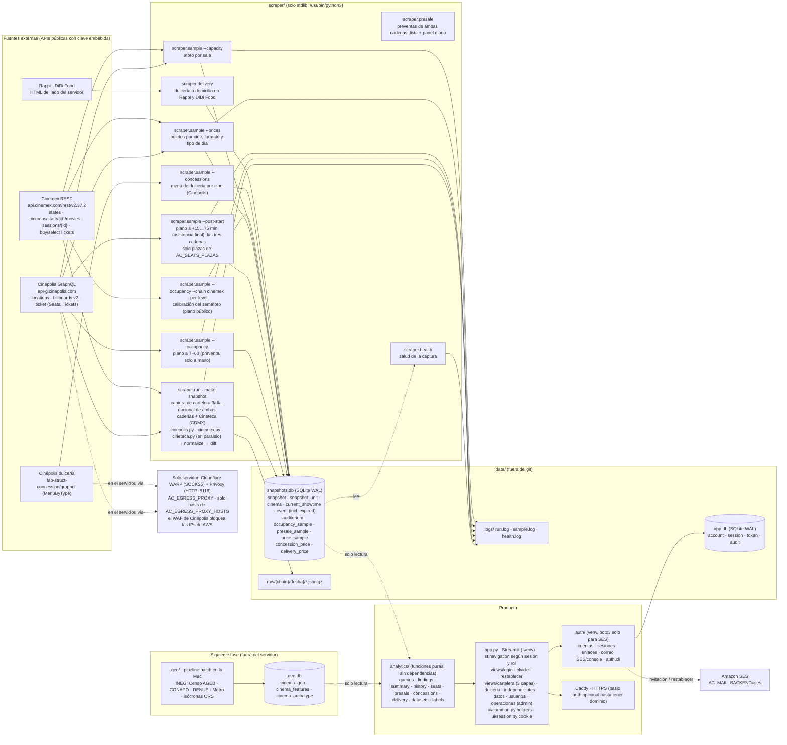

# Arquitectura y servicios

Mapa de todo lo que corre en el proyecto: de dónde salen los datos, qué proceso los toca, dónde se guardan y
qué los programa. Detalle técnico de cada pieza en `project.md`; operación del servidor en `deploy/README.md`;
comandos en `make help`.

## 1. Flujo de datos

Reglas que sostiene el diagrama:

- **Un solo escritor** sobre `snapshots.db`: todo lo que escribe corre en serie desde el mismo timer o en minutos
  distintos (:07); si coincide, SQLite espera hasta 60 s. La captura nacional descarga las dos cadenas en paralelo
  (solo red, 15–30 min) y escribe en serie al final (segundos), así que puede solaparse con el pase de butacas de :50 sin
  que haya dos escritores a la vez. Cada cadena se descarga por unidades que fallan por separado (Cinemex por estado de
  su API, tres a la vez; Cinépolis por lotes de hasta 30 cines agrupados por estado de INEGI): una unidad fallida conserva
  la cartelera anterior de sus cines y queda en `snapshot_unit`. `current_showtime` se escribe por diferencia.
- **La geografía sale de `scraper/plazas.py`.** Cada cine lleva su `city_id` (Cinépolis ciudad, Cinemex área) y su
  `state_id` en la dimensión `cinema` y en cada fila de `current_showtime`; una plaza es la unión de esas llaves para
  ambas cadenas. El estado real (INEGI, `state_code`, ambas cadenas) sale de las coordenadas de cada cine
  (`scraper/states.py`, `scraper/cinema_states.csv`). Los planos de asientos solo se toman en las plazas de `AC_SEATS_PLAZAS`; el dashboard filtra con la
  misma membresía (`analytics/plaza.py`).
- **Solo SQLite: dos archivos, un escritor cada uno** (decisión 2026-09-25; el RDS se apagó por costo y el servidor
  tiene 2 GB). `snapshots.db` la escribe la captura; `app.db`, `auth/`. El dashboard abre `snapshots.db` en modo
  lectura y toda la lógica de negocio vive en `analytics/`, para envolverla después en un API sin reescribir. Lo único
  que escribe desde el dashboard es `auth/`, en `app.db` (cuentas, sesiones, enlaces, auditoría). La confiabilidad sale
  del respaldo diario de ambas bases y del crudo al bucket (`deploy/backup.sh`, restauración en `deploy/README.md`);
  el código del archivo en Postgres quedó en el tag `pre-sqlite-only`.
- **El scraper no tiene dependencias**; el dashboard y `auth/` usan el venv. El futuro `geo/` tendrá su propio venv y
  no corre en el servidor.
- **Cinépolis se alcanza por Cloudflare WARP desde el servidor.** `api-g.cinepolis.com` (cartelera, planos, boletos y
  dulcería) está detrás de Cloudflare y su WAF bloquea los rangos de AWS por ASN (verificado 2026-09-10). En el servidor
  el cliente WARP corre en modo proxy (SOCKS5 local, registro gratuito, sin cuenta) y Privoxy lo convierte en proxy HTTP;
  `scraper/http.py` manda por ahí solo los hosts de `AC_EGRESS_PROXY_HOSTS`. Cinemex, Rappi y DiDi salen directo. En la Mac
  no hace falta: `AC_EGRESS_PROXY` vacío. Operación en `deploy/README.md`.
- **Sesión por cookie propia.** Streamlit no escribe cookies: `ui/session.py` la pone con JavaScript desde un iframe del
  mismo origen y recarga la página; `st.context.cookies` la lee en el handshake. En la base solo vive su sha256; cambiar
  la contraseña o desactivar la cuenta revoca todas las sesiones y surte efecto en ≤ 60 s.

## 2. Programación: qué dispara cada servicio

El calendario tiene una sola fuente: `jobs/registry.py`. Cada trabajo tiene una llave (`jobs/keys.py`) y una entrada con
sus pasos, horario, tope y dónde corre. De ahí salen las unidades de systemd (`deploy/systemd/`, `make units`), los
agentes de launchd de la Mac (`make launchd-load`), las capturas que `scraper.health` espera y esta tabla. Cada unidad
ejecuta `make job KEY=llave`, que corre `python3 -m jobs.run llave`: candado por llave, tope de tiempo, reintentos y una
línea por corrida en `data/logs/jobs.jsonl` con la duración, el resultado y el pico de memoria.

<!-- jobs:begin -->
| Llave (`make job KEY=…`) | Área | Qué hace | Cuándo (CDMX) | Tope | Dónde | Escribe |
| --- | --- | --- | --- | --- | --- | --- |
| `snapshot` | captura | Captura de cartelera: nacional de ambas cadenas más la Cineteca Nacional en CDMX (descarga en paralelo, 15–30 min) | 07:30, 13:30, 20:30 | 45 min | servidor y Mac | `snapshot`, `snapshot_unit`, `cinema`, `current_showtime`, `event`, `data/raw` |
| `seats` | captura | Planos de asientos de las tres cadenas 15–75 min tras el inicio (asistencia final), plazas de AC_SEATS_PLAZAS | cada hora a :50 | 30 min | servidor y Mac | `occupancy_sample` |
| `prices` | captura | Precios de boleto por cine, formato y tipo de día, y menú de dulcería de Cinépolis | 06:07 | 60 min | servidor y Mac | `price_sample`, `concession_price` |
| `delivery` | captura | Dulcería a domicilio de ambas cadenas en Rappi y DiDi Food (las tiendas abren a las 13:00) | 15:07 | 60 min | servidor y Mac | `delivery_price` |
| `capacity` | captura | Aforo por sala de Cinépolis en AC_SEATS_PLAZAS, refresco mensual | día 1, 04:07 | 90 min | servidor | `auditorium` |
| `calibrate-cinemex` | captura | Calibración del semáforo de Cinemex contra el plano público, 100 funciones por nivel (tope 60 por corrida) | 19:07 | 20 min | servidor y Mac | `occupancy_sample` |
| `presale` | captura | Preventas de ambas cadenas: panel de hasta 30 funciones por título en preventa, plano a diario | 10:07 | 45 min | servidor y Mac | `presale_sample`, `data/raw/cinemex_presale` |
| `health` | operación | Salud de la captura en 24 h; sale con 1 si hay huecos o fallos | 08:07 | 5 min | servidor y Mac | `data/logs/health.log` |
| `auth-prune` | acceso | Borra sesiones y enlaces de acceso vencidos hace más de 90 días | domingos 04:07 | 10 min | servidor | `app.db: session`, `token` |
| `backup` | operación | Copia consistente de snapshots.db y del crudo al bucket | 05:07 | 30 min; 1 reintento a los 10 min | servidor | `bucket de respaldo` |
| `deploy` | operación | Trae origin/stable si se movió, reinstala si cambió requirements, sincroniza unidades y reinicia el dashboard | cada hora a :02 y :17 y :32 y :47 | 10 min | servidor | `código en /opt/absolut-cinema`, `data/logs/deploy.log` |
<!-- jobs:end -->

Fuera del registro, siempre encendidos en el servidor: `absolut-cinema-dashboard.service` (Streamlit en 127.0.0.1:8501,
detrás de Caddy) y `warp-svc` + `privoxy` (salida por Cloudflare para Cinépolis). GitHub Actions mueve la rama `stable`
cuando pasan las pruebas y el trabajo `deploy` la trae. A mano, con `!` en la sesión: `make capacity-cinemex PLAZAS=all`
(pasada nacional única de aforo). Ningún flujo abre órdenes de checkout: el plano de Cinemex sale del `GET` público.

## 3. Catálogo de servicios

| Servicio | Tipo | Cadencia | Escribe en | Quién lo lanza |
| --- | --- | --- | --- | --- |
| `scraper.run` (`make snapshot`) | captura de cartelera (descarga en paralelo, 15–30 min): nacional de ambas cadenas más la Cineteca Nacional en CDMX (`cineteca.py`, aditiva, fuera del head-to-head) | 07:30, 13:30, 20:30 | `snapshot`, `snapshot_unit`, `cinema`, `current_showtime`, `event` (incl. `expired`), crudo | trabajo `snapshot` |
| `sample --occupancy` (`make occupancy`) | plano a T−60 (preventa), Cinépolis | a mano | `occupancy_sample` (`minutes_to_start` ≥ 0) | manual |
| `sample --post-start` (`make seats`) | plano 15–75 min tras el inicio, las tres cadenas (asistencia final; Cinemex desde 2026-09-25, Cineteca desde 2026-09-26), solo plazas de `AC_SEATS_PLAZAS` | cada hora | `occupancy_sample` (`minutes_to_start` < 0) | trabajo `seats` |
| `scraper.presale` (`make presale`) | preventas de ambas cadenas: títulos de la landing `preventas` de Cinemex y de "Próximamente" de Cinépolis, panel de hasta 30 funciones por título y cadena releído a diario con el plano | diario 10:07 | `presale_sample`, crudo `raw/{chain}_presale/` | trabajo `presale` |
| `sample --prices` (`make prices`) | boletos por cine, formato, tipo de día | diario | `price_sample` | trabajo `prices` |
| `sample --concessions` (`make concessions`) | menú de dulcería con precio, Cinépolis | diario; cada cine se renueva a los 7 días | `concession_price` | idem |
| `scraper.delivery` (`make delivery`) | dulcería a domicilio, ambas cadenas, Rappi y DiDi Food | diario 15:07; cada tienda a los 7 días | `delivery_price` | trabajo `delivery` |
| `sample --capacity` | aforo por sala, Cinépolis, en `AC_SEATS_PLAZAS`; `PLAZAS=all` = pasada nacional única a mano (hecha 2026-09-12, también Cinemex) | mensual | `auditorium` | trabajo `capacity`; Cinemex a mano |
| `sample --occupancy --chain cinemex --per-level` | calibración del semáforo con el plano público, hasta 100 muestras por nivel | diario 19:07 | `occupancy_sample` | trabajo `calibrate-cinemex` |
| `scripts/title_pairs.py` | candidatos de títulos entre cadenas para `scraper/title_pairs.csv`; `--accept` / `--reject` | a mano, cuando `scraper.health` avisa | `scraper/title_pairs.csv` (versionado) | manual |
| `jobs.run` (`make job KEY=…`) | ejecuta un trabajo del registro: candado por llave, tope, reintentos; genera las unidades con `jobs.units` | lo lanza cada timer | `logs/jobs.jsonl` (duración, resultado, pico de memoria), `data/locks/` | systemd / launchd / a mano |
| `scraper.health` (`make health`) | salud de la captura: capturas programadas, fallos, muestreos; las mismas funciones alimentan en vivo la página Operaciones | diario | `logs/health.log` | trabajo `health` |
| `backup.sh` | copias en línea de `snapshots.db` y `app.db` y sync del crudo | diario 05:07 | bucket (`db/`, `app/`, `raw/`) | trabajo `backup` |
| `app.py` (+ `ui/`, `views/`) | dashboard Streamlit con login por usuario: Cartelera, Dulcería, Independientes (Cineteca Nacional), Datos (explorador de tablas de SQLite) y, para admin, Usuarios y Operaciones (estado de captura, bases, servidor y logs; lee `scraper.health`) | siempre | `app.db` vía `auth/` (cuentas, sesiones, enlaces, auditoría); `snapshots.db`, solo lectura | `dashboard.service`, detrás de Caddy |
| `auth.cli` (`make user-create`, `user-list`, `user-reset`, `user-deactivate`, `user-activate`) | administración de cuentas desde la terminal; así nace el primer admin | a mano | `app.db`; correo por SES o `data/logs/mail.log` | manual |
| `auth.cli prune` (`make auth-prune`) | borra sesiones y enlaces vencidos hace más de 90 días | domingos 04:07 | `app.db`: `session`, `token` | trabajo `auth-prune` |
| GitHub Actions `tests.yml` | pruebas en cada push a `main`; si pasan, mueve la rama `stable` a ese commit | cada push | rama `stable` del repo | GitHub |
| `deploy/update.sh` (`make deploy`) | si `origin/stable` se movió: lo trae, reinstala si cambió `requirements-*`, reinicia el dashboard, comprueba salud | cada 15 min | código en `/opt/absolut-cinema`, `logs/deploy.log` | trabajo `deploy` |
| `warp-svc` + `privoxy` (solo servidor) | salida por Cloudflare WARP para `api-g.cinepolis.com`, cuyo WAF bloquea AWS; `http.py` la usa vía `AC_EGRESS_PROXY` | siempre | nada | systemd, instalados por `install.sh` |
| `geo/` (futuro) | features de zona y arquetipos | trimestral | `geo.db` | a mano en la Mac |

## 4. Identidades y llaves que cruzan todo

- **Cine**: Cinépolis por `slug` (`cinepolis-universidad-cdmx`), Cinemex por id numérico. Ambos con lat/lng, `city_id`
  (Cinépolis ciudad, Cinemex área) y, en Cinemex, `state_id`; dimensión `cinema` en SQLite.
- **Plaza**: clave de `scraper/plazas.py` (`cdmx`, `gdl`, `mty`) = unión de `city_id` de ambas cadenas. `None` es nacional.
- **Función**: `show_id`. En Cinemex es el id nacional de sesión; en Cinépolis `slug-del-cine:sessionId`,
  porque el `sessionId` de Vista solo es único por cine.
- **Sala**: `(chain, cinema_id, screen)`, llave de `auditorium`.
- **Muestra de ocupación**: una fila por lectura; el signo de `minutes_to_start` distingue preventa (T−60) de
  asistencia (post-inicio). El par de una misma función se une por `show_id`.
- **Evento**: `(chain, show_id, kind, detected_at)` con la fila completa antes y después; `expired` cierra la vida
  normal de una función y permite reconstruir la cartelera de un día pasado (`analytics/history.py`: `functions_on`, `showtime_timeline`, `board_as_of`).
